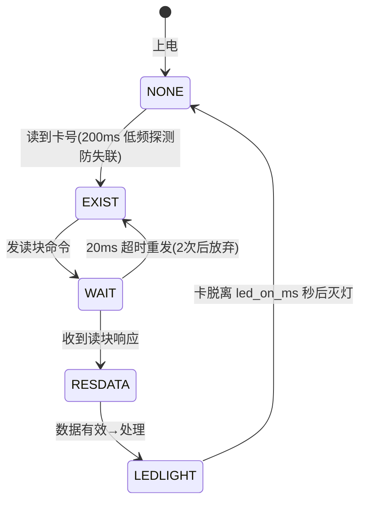
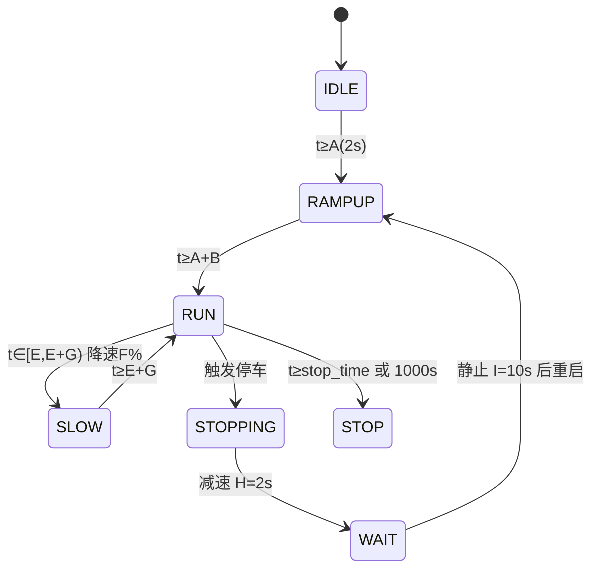

# 系统架构

## 1. 总体分层

```mermaid
graph LR
    C["components/common: config.h/pins.h"] --> P["参数层 nvs_params + 转换 gbk_utf8"]
    P --> D["components/common: 驱动(card_uart/tts/motor_drv/led/ws2812/adc/debug)"]
    D --> W["配网组件 config_mode/wifi_ap/web_server(webpage.html+cJSON)"]
    W --> L["components/common: 纯逻辑(rfid_logic/motor_logic/card_parse)"]
    L --> A["main: 应用状态机(rfid_process/motor_process)"]
    A --> M["app_main 调度"]
```

- 共享组件 components/common 是两版（rtos/baremetal）唯一维护点；main 仅 4 组差异文件（app_main + rfid/motor 任务或进程版），run_tests.sh 漂移检查保证一致
- 纯逻辑层与 STM32 版逐字相同，主机可测；时序/规则经 Setter 注入（MotorLogic_SetTiming/RfidLogic_SetConfig），默认值=config.h 宏（2026-08 更新）

## 2. 启动流程
```mermaid
flowchart TD
    S["上电"] --> H["LED_Init / Motor_Drv_Init / Dbg_Init"]
    H --> C["Card_Uart_Init(含波特率切换 9600→115200)"]
    C --> T["TTS_Init → params_init(NVS 读参数) → Motor_SetDirection"]
    T --> Q["config_mode_boot_check 连按3次RST检测"]
    Q -->|达阈值| CFG["config_mode_run 配网模式(AP+网页, 空闲5min重启, 不返回)"]
    Q -->|否| IJ["MotorLogic_SetTiming + RfidLogic_SetConfig 注入 g_params"]
    IJ --> M["Motor_Init(autostop_ms 参数化, 无ADC采样)"]
    M --> R["RFID_Init(TTS_SetupDefaults <I>7)"]
    R --> LOOP["运行时调度"]

## 3. 主循环模型（裸机）
```c
while(1) {
    RFID_Process();   /* 含 Card_Uart_Poll 轮询读卡串口 + 绿色确认窗计时 */
    Motor_Process();
    vTaskDelay(pdMS_TO_TICKS(1));   /* tick=1000Hz 下 =1ms，让出 CPU 防看门狗 */
}
```
- 所有延时非阻塞（esp_timer 时间差）；TTS 发送（约 17ms）期间状态机停顿可接受
- （2026-08 更新）FreeRTOS tick 已由默认 100Hz 改为 **1000Hz**（sdkconfig CONFIG_FREERTOS_HZ=1000）：修复 pdMS_TO_TICKS(1)=0 的忙等与 IDLE 饿死 WDT 刷屏问题；app_main.c/rfid_process.c 头部注释仍写"100Hz/10ms"属遗留文档债，行为以 sdkconfig 为准。另有配置模式辅助任务 cfgclr（上电 10s 后清 NVS 配网计数，栈 4096B）

## 4. 状态机
### 读卡五态（card_res_flag）

- （2026-08 更新）触发停车新增绿色确认窗：RESDATA 处理命中 EV_TRIGGER_STOP 时先亮绿 TRIGGER_ACK_GREEN_MS=500ms，到期才置 motor_trigger_flag 进入停车序列；LEDLIGHT/NONE 态在 Motor_IsBusyForLed()=1（STOPPING/WAIT/RAMPUP）时不碰 RGB 颜色
### 电机状态机（motor_logic，绝对计时）

