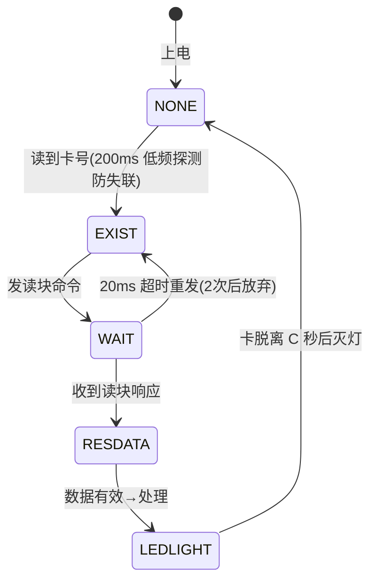
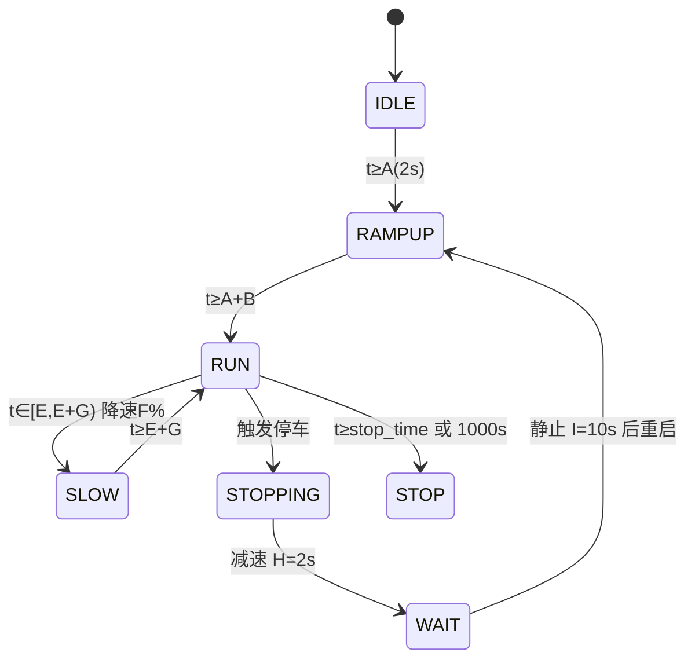

# 系统架构

## 1. 总体分层

- 共享组件 components/common 是两版（rtos/baremetal）唯一维护点；main 仅 4 组差异文件（app_main + rfid/motor 任务或进程版），run_tests.sh 漂移检查保证一致
- 纯逻辑层与 STM32 版逐字相同，主机可测

## 2. 启动流程
```mermaid
flowchart TD
    S["上电"] --> H["LED_Init / Motor_Drv_Init / Dbg_Init"]
    H --> C["Card_Uart_Init(含波特率切换 9600→115200)"]
    C --> T["TTS_Init / ADC_Init"]
    T --> M["Motor_Init(电位器采样+状态)"]
    M --> R["RFID_Init(TTS_SetupDefaults+参数)"]
    R --> LOOP["运行时调度"]

## 3. 主循环模型（裸机）
```c
while(1) {
    RFID_Process();   /* 含 Card_Uart_Poll 轮询读卡串口 */
    Motor_Process();
    vTaskDelay(1);    /* 100Hz 节拍下 =10ms，让出 CPU 防看门狗 */
}
```
- 所有延时非阻塞（esp_timer 时间差）；TTS 发送（约 17ms）期间状态机停顿可接受

## 4. 状态机
### 读卡五态（card_res_flag）

### 电机状态机（motor_logic，绝对计时）

