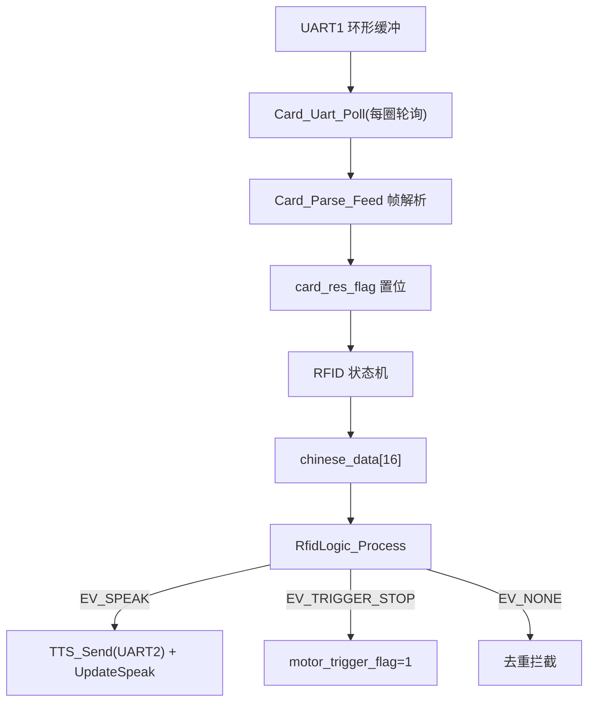
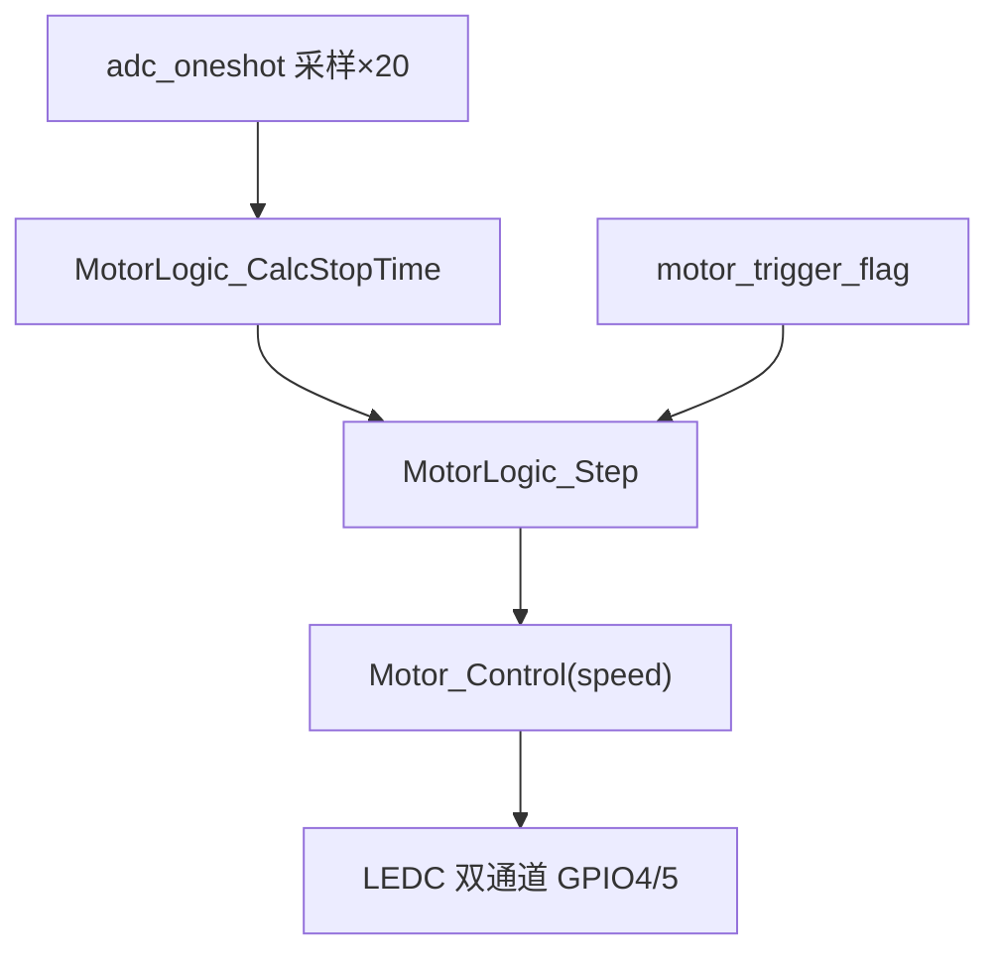

# 数据流与控制流

## 1. 读卡数据流

## 2. 电机控制流

## 3. 触发停车完整链路
读卡 → rfid_logic 命中规则 → EV_TRIGGER_STOP → motor_trigger_flag → MotorLogic_Step 消费 → STOPPING(2s)→WAIT(10s)→RAMPUP→RUN
## 4. LED 控制流
LEDLIGHT：LED_Sta(1) → 800ms 后每 10ms ReadCard → 回调刷新 rfid_last_card_tick → 脱离 C=3s 灭灯；NONE 态 200ms 探测读卡号
