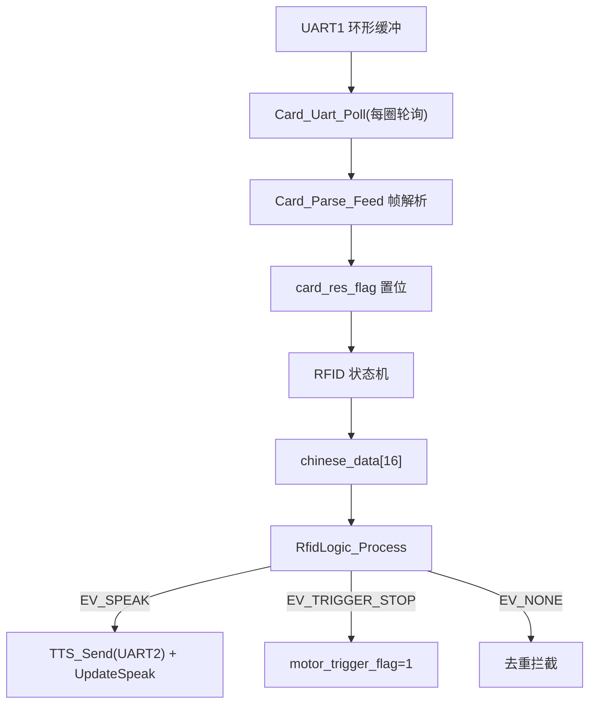
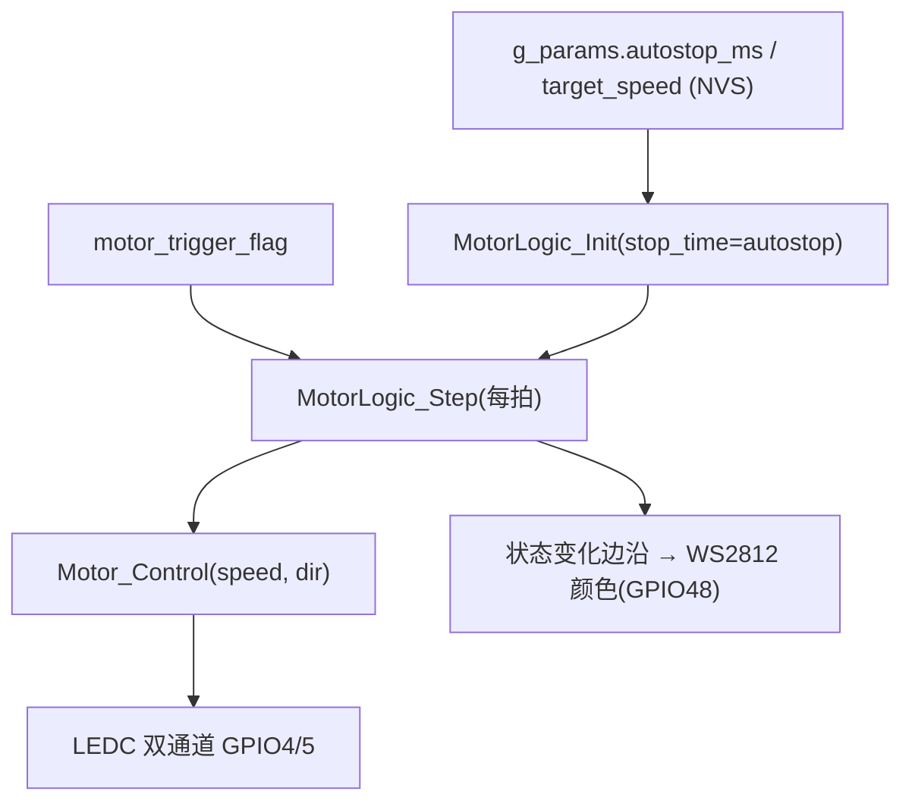
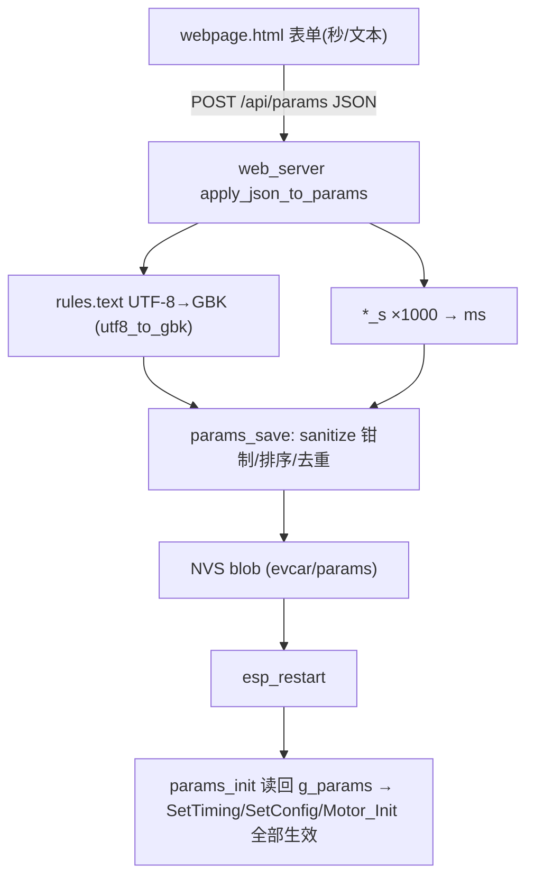

# 数据流与控制流

## 1. 读卡数据流

## 2. 电机控制流（2026-08 更新：电位器采样已删除）

- （2026-08 说明）MotorLogic_CalcStopTime 电位器公式仅存共享层供 STM32 使用，ESP32 两版均无调用方

## 3. 触发停车完整链路
读卡 → rfid_logic 命中规则 → EV_TRIGGER_STOP → 绿色确认窗 500ms(s_trig_pending) → motor_trigger_flag → MotorLogic_Step 消费 → STOPPING(H=stop_ramp_ms)→WAIT(I=wait_ms)→RAMPUP→RUN（2026-08 更新：插入绿窗环节）

## 4. LED 控制流
LEDLIGHT：LED_Sta(1)（绿）→ 等 rfid_poll_ms(默认800ms) 后每 10ms ReadCard → 回调刷新 rfid_last_card_tick → 脱离 led_on_ms(默认3s) 灭灯（微白）；NONE 态 200ms 探测读卡号；Motor_IsBusyForLed()=1（STOPPING/WAIT/RAMPUP）期间不碰 RGB（2026-08 更新）

## 5. 参数配置数据流（2026-08 新增）

