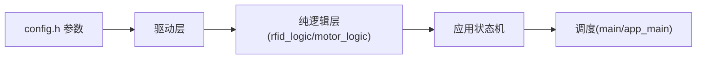

# SUMMARY - esp32_tts_baremetal

## 一句话描述
esp32_tts_baremetal：ESP32-S3 @160MHz（sdkconfig 设定），2MB Flash/512KB SRAM 上的读卡语音播报电机控制复刻项目（裸机版单任务超级循环），U13T 读卡 + CN-TTS 播报 + 多触发词停车 + WiFi 配网网页调参。（2026-08 更新）

## 核心功能
1. 晚启动 A=2s + 缓启动 B=4s 线性加速至 999（均可参数化）
2. 实时读卡：卡在线圈上 LED 常亮，脱离 led_on_ms(默认3s) 熄灭
3. TTS 播报：单块 16 字节 GBK；dedup_ms(默认10s) 相同内容去重；上电提示音 <I>7
4. 多段定时降速：slowwins[]（默认 42s 起 F=50% 持续 5s，绝对计时）
5. 触发停车：一次性词/计数型词 → 绿色确认窗 500ms → 停车序列（H=2s 减速 + I=10s 静止 + 重启）；已触发词整个上电周期不再停车
6. 自动永久停止：autostop_ms 网页可设 10~1000s（默认 300s；电位器方案退役）（2026-08 更新）
7. 数据输出口：实时输出读卡/电机/LED/配网状态
8. WiFi 配网模式：连按 3 次 RST 进入（EV-Car-Setup/WPA2），网页全参数配置存 NVS（2026-08 新增）

## 硬件平台
| 项目 | 内容 |
|---|---|
| 芯片 | ESP32-S3 @160MHz（sdkconfig CONFIG_ESP_DEFAULT_CPU_FREQ_MHZ_160=y），2MB Flash/512KB SRAM，FreeRTOS tick 1000Hz |
| 读卡模块 | U13T（UART1 GPIO10/11，9600→115200） |
| 语音模块 | CN-TTS（UART2 GPIO12/13，9600） |
| 电机 | LEDC 双通道互补 GPIO4/5（20kHz），转向可设 |
| 电位器 | **已退役**（ADC1_CH0 GPIO1 悬空无影响） |
| LED | GPIO2/8/9（低电平亮）+ 板载 WS2812 RGB（GPIO48，RMT/GRB） |
| 调试输出 | USB-Serial-JTAG console |
| 配网热点 | EV-Car-Setup（WPA2/12345678）→ http://192.168.4.1 |

## 架构图

## 已知风险（前 3，2026-08 更新）
1. 中文路径依赖 CONFIG_LIBC_NEWLIB=y（勿删）
2. params_t 结构变更会使旧 NVS blob 尺寸不匹配→回落默认一次，网页参数需重配（ESP32 版 blob 无独立 magic/CRC）
3. 绝对计时下停车重启后可能立即 STOP（设计既定，autostop_ms 可网页调大缓解）；源码个别注释仍写"100Hz 节拍"与 sdkconfig 1000Hz 不符（文档债）

## 代码规模
- 业务源文件：18 个 .c（common 15 + main 3）；导出函数约 52 个
- 主机单元测试：ESP32 87 项（rfid_logic 32 + card_parse 14 + motor_logic 30 + gbk_utf8 11）+ 两版漂移检查（编译前必跑）
