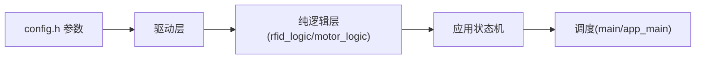

# SUMMARY - esp32_tts_baremetal

## 一句话描述
esp32_tts_baremetal：ESP32-S3 @240MHz，2MB Flash/512KB SRAM 上的读卡语音播报电机控制复刻项目（裸机版（单任务超级循环）），U13T 读卡 + CN-TTS 播报 + 多触发词停车。

## 核心功能
1. 晚启动 A=2s + 缓启动 B=4s 线性加速至 999
2. 实时读卡：卡在线圈上 LED 常亮，脱离 C=3s 熄灭
3. TTS 播报：单块 16 字节 GBK；D=10s 相同内容去重
4. 定时降速：E=42s 起降为 F=50%，G=5s 后恢复（绝对计时一次）
5. 触发停车：太阳 1 次触发 / 地球 2 次触发（间隔≥10s）→ 停车序列（H=2s 减速 + I=10s 静止 + 重启）
6. 电位器自动停止：10s~600s 线性
7. 数据输出口：实时输出读卡/电机/LED 状态

## 硬件平台
| 项目 | 内容 |
|---|---|
| 芯片 | ESP32-S3 @240MHz，2MB Flash/512KB SRAM |
| 读卡模块 | U13T（USART1 GPIO10/11，9600→115200） |
| 语音模块 | CN-TTS（USART2 GPIO12/13，9600） |
| 电机 | LEDC 双通道互补 GPIO4/5（20kHz） |
| 电位器 | ADC1_CH0 GPIO1 |
| LED | GPIO2/8/9（低电平亮） |
| 调试输出 | USB-Serial-JTAG |

## 架构图

## 已知风险（前 3）
1. 中文路径依赖 CONFIG_LIBC_NEWLIB=y（勿删）
2. FreeRTOS 100Hz 节拍下 vTaskDelay(1)=10ms（超时已改真实时间差）
3. 绝对计时下停车重启后可能立即 STOP（设计既定）

## 代码规模
- 业务+平台源文件：12 个；业务函数：13 个
- 主机单元测试：ESP32 76 项 + 漂移检查（编译前必跑）
