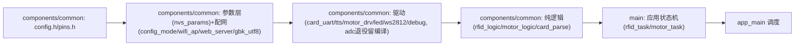
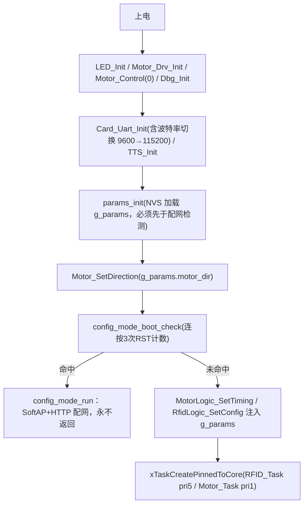
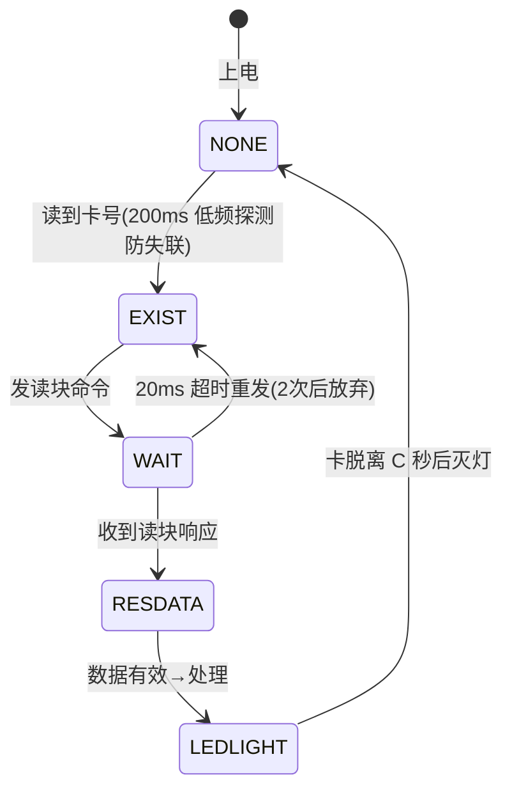
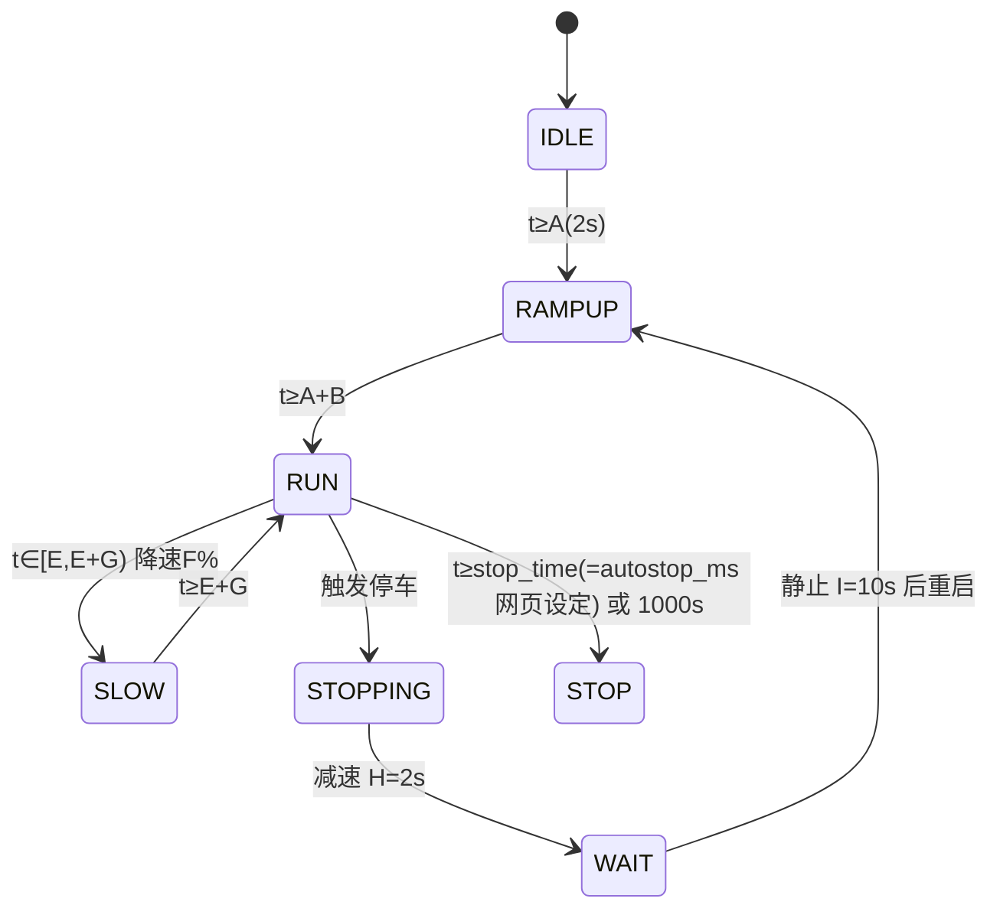

# 系统架构

## 1. 总体分层

- 共享组件 components/common 是两版（rtos/baremetal）唯一维护点；main 仅 4 组差异文件（app_main + rfid/motor 任务或进程版），run_tests.sh 漂移检查保证一致
- 纯逻辑层与 STM32 版逐字相同，主机可测
<!-- 补充于 2026-08-25 | 类型: 修正错误 -->（2026-08 更新：分层图加入参数层与配网组件；adc 移入退役区）

## 2. 启动流程

> （2026-08 更新：移除 ADC_Init 与 Motor 电位器初始化；新增参数加载/转向应用/配网检测/Setter 注入。来源 esp32/esp32_tts_rtos/main/app_main.c）

## 3. 任务模型（FreeRTOS）
| 任务 | 优先级 | 栈 | 职责 | 文件 |
|---|---|---|---|---|
| RFID_Task | 5 | 4096B | 读卡五态/播报/LED/触发（任务内先 TTS_SetupDefaults） | main/rfid_task.c |
| Motor_Task | 1 | 2048B | 每拍喂 motor_logic + PWM 输出 + RGB 状态色（stop_time=g_params.autostop_ms） | main/motor_task.c |
| cfg_clear_task | 1 | 4096B | 上电 10s 后清 NVS cfg_cnt 计数（非配置模式手势时自动清零） | components/common/config_mode.c |

- 任务通信：全局 volatile 标志（card_res_flag / motor_trigger_flag）
- FreeRTOS tick **1000Hz**（CONFIG_FREERTOS_HZ=1000，sdkconfig.defaults）：vTaskDelay(1)=1ms；超时类逻辑用 esp_timer 真实时间差（v0.5 修复漂移）。tick 由 100 提到 1000 是为修复 pdMS_TO_TICKS(1)=0 导致的忙等与 IDLE 饿死 WDT 刷屏。（2026-08 更新）

## 3.1 配置模式（2026-08 新增）
- 进入手势：快速连按 3 次 RST（等效快速通断电）。实现=每次"正常复位"上电 NVS 键 evcar/cfg_cnt +1；PANIC/看门狗/欠压复位不累计且保留原计数；持续运行 10s 后由 cfg_clear_task 清零；计数达 3 即进入并消费计数。
- 进入后：RGB 常亮蓝 → wifi_ap_start（EV-Car-Setup/WPA2/12345678/192.168.4.1）→ web_server_start → 主循环每 5s 检查 web_server_idle_seconds()≥300 则自动重启回正常模式。
- 未进入时的诊断：蓝色快闪 cnt 次；本次复位被过滤（崩溃类）则红色长亮 1s。

## 4. 状态机
### 读卡五态（card_res_flag）

### 电机状态机（motor_logic，绝对计时）

> （2026-08 更新：stop_time 原由电位器采样算出，现直接取 g_params.autostop_ms；MotorLogic_CalcStopTime 公式保留在共享层供 STM32 版使用。）
