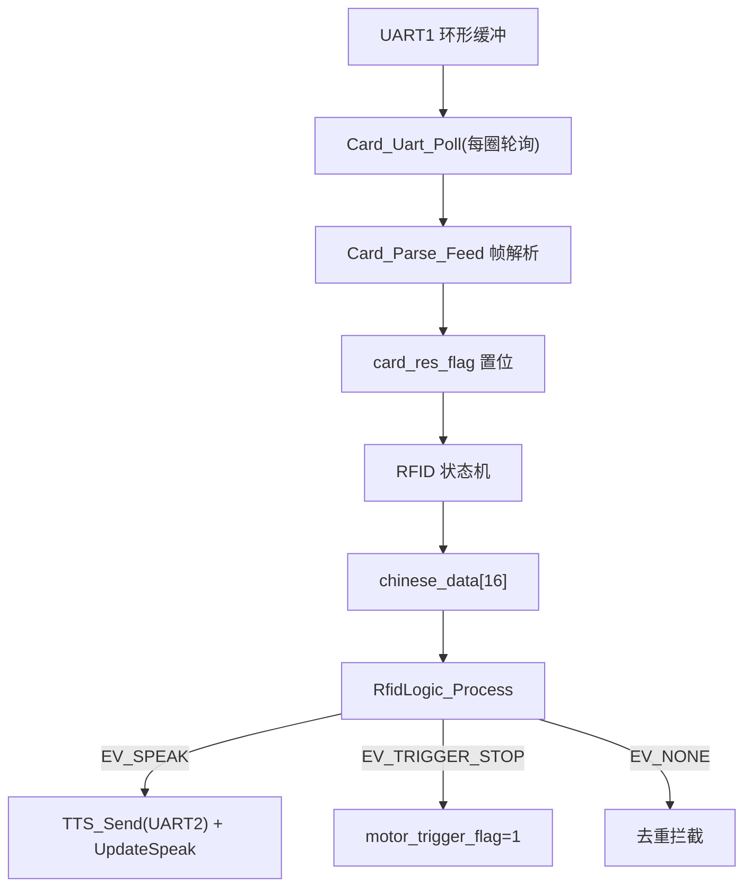
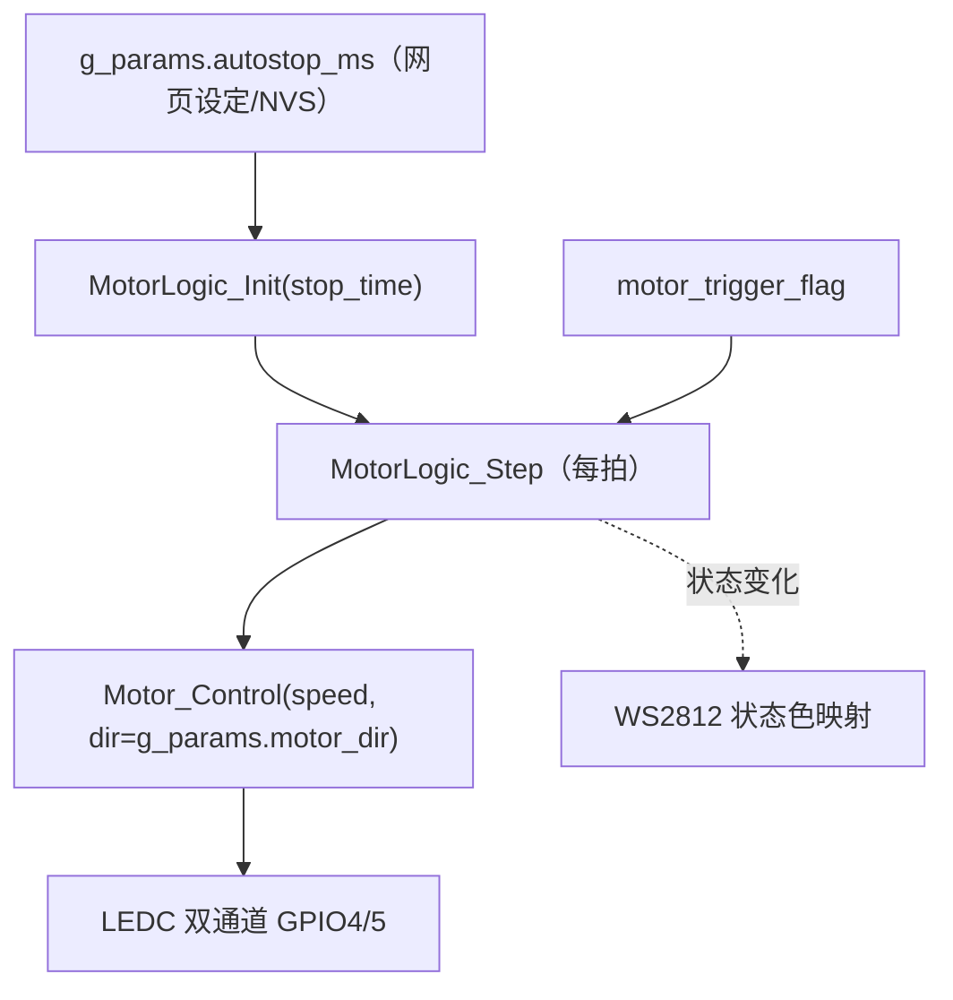
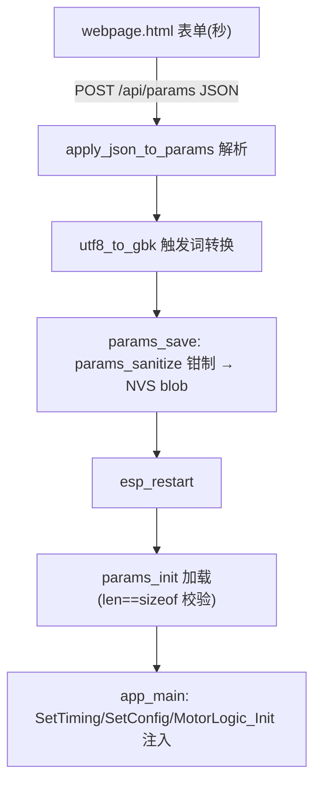

# 数据流与控制流

## 1. 读卡数据流

## 2. 电机控制流

> （2026-08 更新：移除电位器 ADC 采样与 MotorLogic_CalcStopTime 调用——stop_time 直接取参数层；MotorLogic_CalcStopTime 公式保留在共享层供 STM32 版。）

## 3. 触发停车完整链路
读卡 → rfid_logic 命中规则 → EV_TRIGGER_STOP → s_trig_pending 绿色确认窗 500ms（RGB 先亮绿）→ motor_trigger_flag=1 → MotorLogic_Step 消费 → STOPPING(H=2s)→WAIT(I=10s)→RAMPUP→RUN

## 4. LED 控制流
LEDLIGHT：LED_Sta(1)（三引脚亮 + RGB 绿）→ g_params.rfid_poll_ms（默认 800ms）后每 RFID_LED_POLL_MS=10ms ReadCard → 回调刷新 rfid_last_card_tick → 卡脱离 g_params.led_on_ms（默认 C=3s）灭灯回 NONE；NONE 态 200ms 探测读卡号；电机 STOPPING/WAIT/RAMPUP 期间 Motor_IsBusyForLed()=1 不覆盖 RGB 颜色。（2026-08 更新：两处延时参数化）

## 5. 参数配置闭环链路（2026-08 新增）

