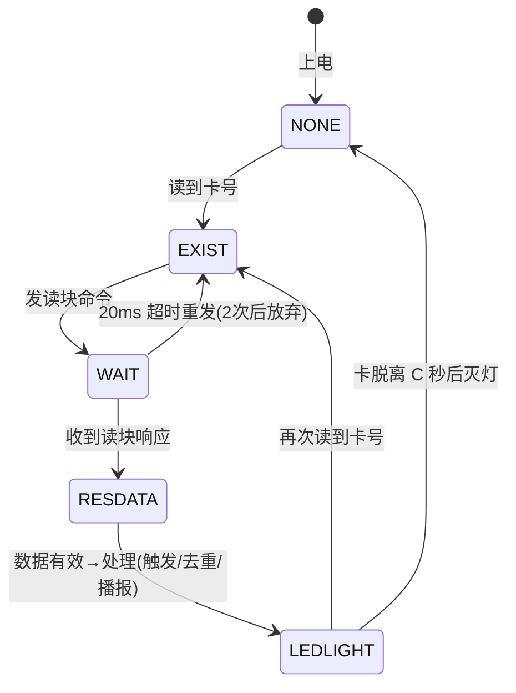
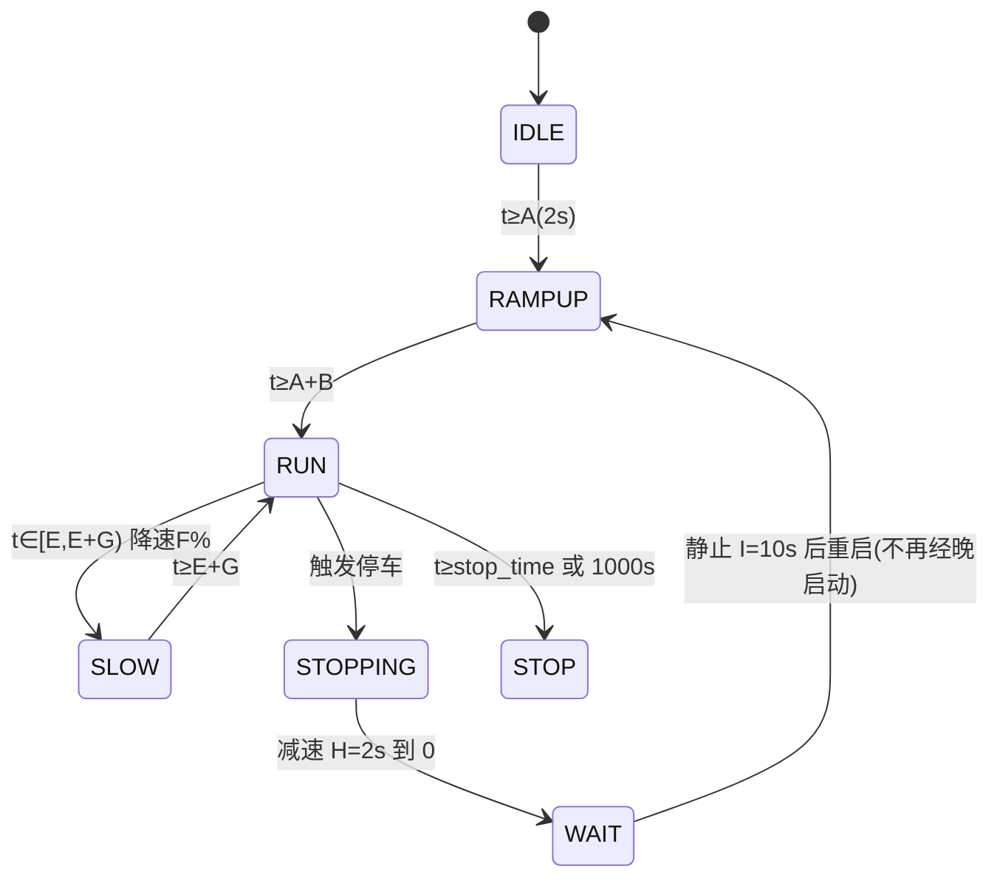

# 系统架构

## 1. 总体分层

- config.h（纯参数）→ hardware/（HAL 驱动）→ 纯逻辑层（无硬件依赖，四版共享）→ 应用状态机 → main 调度
- 依赖单向，无循环；纯逻辑层（rfid_logic/motor_logic）与 STM32/ESP32 各版逐字相同，主机可测

## 2. 启动流程
```mermaid
flowchart TD
    S["上电"] --> H["HAL_Init + SystemClock_Config"]
    H --> P["MX_GPIO/ADC1/TIM2/USART1/2/3 初始化"]
    P --> B["USART1 波特率切换(9600→115200, 先使能接收防ORE)"]
    B --> I["LED_Sta(0) / PWM_Init / Motor_Control(0) / Dbg_Init"]
    I --> T["TTS 设置(语速/音量/保存)"]
    T --> R["RFID 参数初始化 + 卡状态 EXIST"]
    R --> LOOP["运行时调度"]

## 3. 主循环模型（裸机）
```c
while(1) {
    RFID_Process();   /* 读卡/播报/LED/触发（非阻塞状态机） */
    Motor_Process();  /* 电机时序（非阻塞状态机，喂 motor_logic） */
}
```
- 所有延时用 HAL_GetTick() 时间差非阻塞实现；TTS 发送（约 17ms）期间两状态机停顿，缓启动跳档毫秒级可接受

## 4. 状态机
### 读卡五态（card_res_flag）

### 电机状态机（motor_logic，绝对计时）

