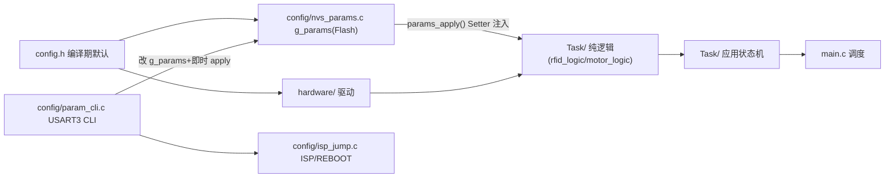
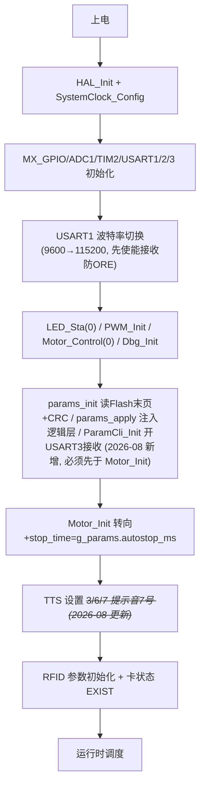
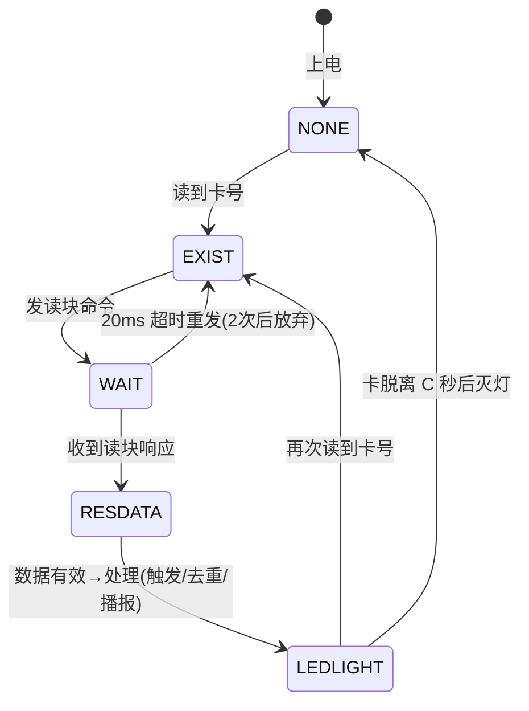
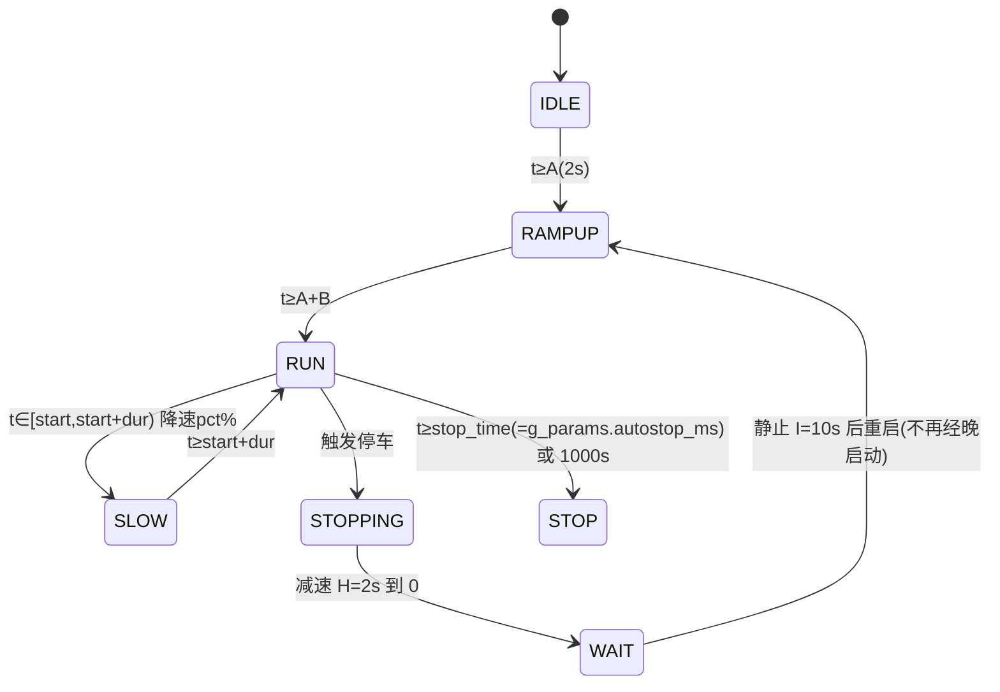

# 系统架构

## 1. 总体分层

- config.h（纯参数）→ hardware/（HAL 驱动）→ 纯逻辑层（无硬件依赖，四版共享）→ 应用状态机 → main 调度
- 依赖单向，无循环；纯逻辑层（rfid_logic/motor_logic）与 STM32/ESP32 各版逐字相同，主机可测
- （2026-08 更新）新增 config/ 参数层：nvs_params 持久化 g_params 并经 MotorLogic_SetTiming/RfidLogic_SetConfig 注入共享逻辑层；param_cli 经 USART3 行协议修改 g_params 后即时重新注入；isp_jump 提供软跳 Bootloader 与复位钩子。Init 签名未变——不调用 params_init 时逻辑层仍用 config.h 宏默认值

## 2. 启动流程


## 3. 主循环模型（裸机）
```c
while(1) {
    RFID_Process();    /* 读卡/播报/LED/触发（非阻塞状态机） */
    Motor_Process();   /* 电机时序（非阻塞状态机，喂 motor_logic） */
    ParamCli_Poll();   /* 串口配置模式行解析（2026-08 新增） */
    if( ParamCli_ShouldEnterIsp() ) { HAL_Delay(100); ISP_Enter(); } /* ISP 命令软跳 Bootloader */
}
```
- 所有延时用 HAL_GetTick() 时间差非阻塞实现；TTS 发送（约 17ms）期间各状态机停顿，缓启动跳档毫秒级可接受
- ParamCli_Poll 为 RXNE 轮询收包（非中断），每圈最多消化当前缓冲字节
- （修正于 2026-08：原文本节前 mermaid 围栏未闭合，已补齐）

## 4. 状态机
### 读卡五态（card_res_flag）

### 电机状态机（motor_logic，绝对计时）

- （2026-08 更新）降速窗口由单窗口 E/G/F 升级为最多 8 段 slowwins[start_ms,dur_ms,pct]（默认仍为 42s/5s/50%）；stop_time 由电位器计算改为 g_params.autostop_ms（Motor_Init 注入）；H/I 时序同样经 MotorLogic_SetTiming 运行时可调。停车序列期间不检查自动停车。
