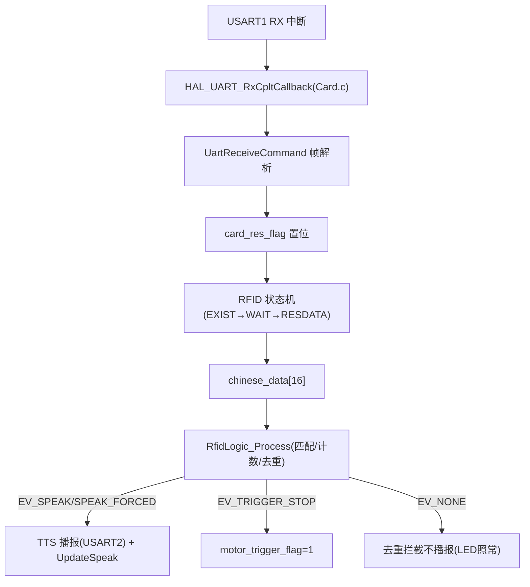
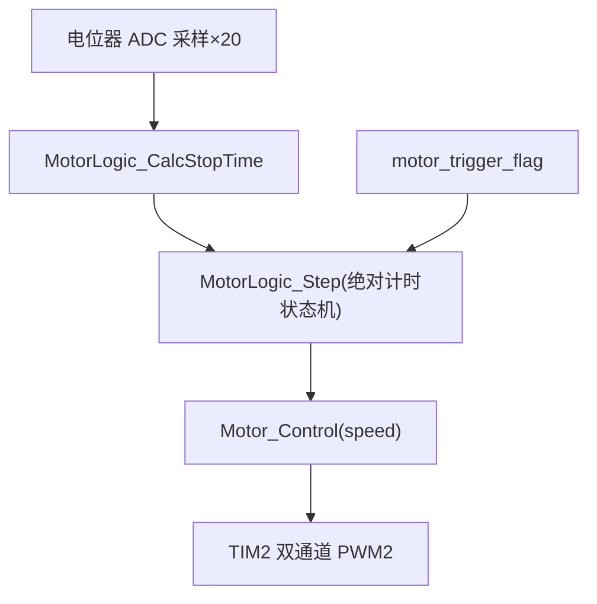

# 数据流与控制流

## 1. 读卡数据流

## 2. 电机控制流

## 3. 触发停车完整链路
读卡 → rfid_logic 命中规则（太阳第 1 次/地球第 2 次且间隔≥10s）→ EV_TRIGGER_STOP → motor_trigger_flag → MotorLogic_Step 消费 → STOPPING(H=2s 线性减速) → WAIT(I=10s 静止) → RAMPUP(重启缓启动，不再经晚启动) → RUN
## 4. LED 控制流
读到卡 → LEDLIGHT：LED_Sta(1) → 播报后 800ms → 每 10ms 轮询 ReadCard() → 卡在场回调刷新 rfid_last_card_tick → 脱离后 now-last_tick ≥ C=3s → LED_Sta(0) 回 NONE
