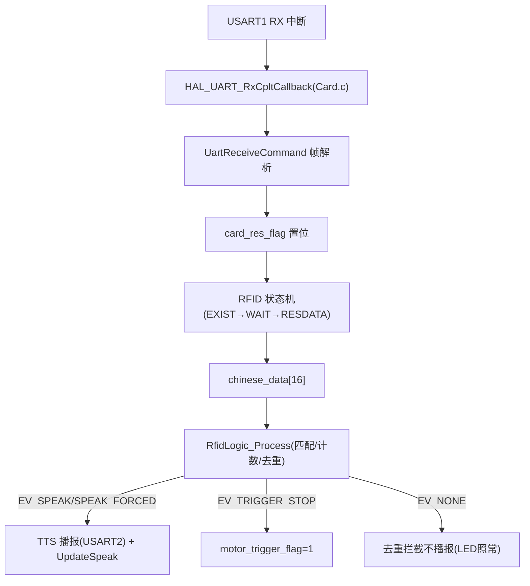
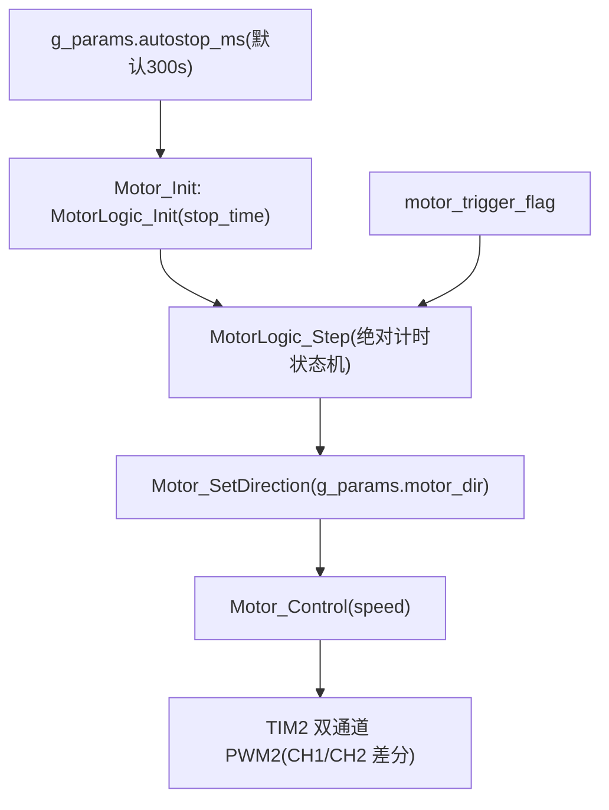
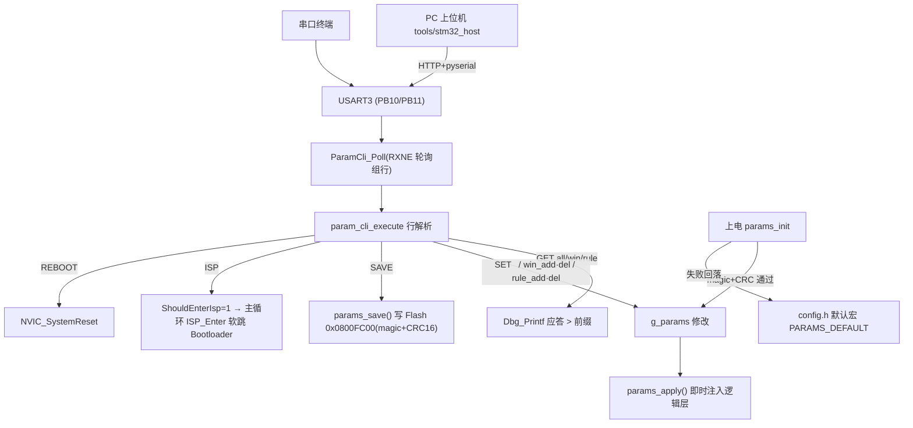

# 数据流与控制流

## 1. 读卡数据流

## 2. 电机控制流

- （2026-08 更新）电位器 ADC 采样退役：stop_time 由 Motor_Init 直接取 g_params.autostop_ms；MotorLogic_CalcStopTime 公式保留共享层未用
## 3. 触发停车完整链路
读卡 → rfid_logic 命中规则（太阳第 1 次/地球第 2 次且间隔≥10s）→ EV_TRIGGER_STOP → motor_trigger_flag → MotorLogic_Step 消费 → STOPPING(H=2s 线性减速) → WAIT(I=10s 静止) → RAMPUP(重启缓启动，不再经晚启动) → RUN
## 4. LED 控制流
读到卡 → LEDLIGHT：LED_Sta(1) → 播报后 RFID_READ_DELAY_MS(800ms) → 每 g_params.rfid_poll_ms（默认 800ms，2026-08 更新接入运行时参数）轮询 ReadCard() → 卡在场回调刷新 rfid_last_card_tick → 脱离后 now-last_tick ≥ g_params.led_on_ms（默认 C=3s）→ LED_Sta(0) 回 NONE

## 5. 参数配置数据流（2026-08 新增）

- 上电链路：Flash 末页校验通过 → g_params=Flash 值(sanitize 后)；否则回落 config.h 宏；随后 params_apply() 注入 MotorLogic_SetTiming/RfidLogic_SetConfig
