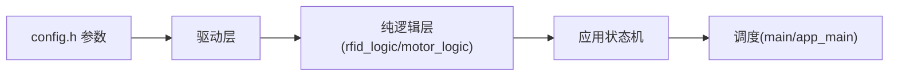

# SUMMARY - stm32_rfid_tts_baremetal

## 一句话描述
stm32_rfid_tts_baremetal：STM32F103C8T6 @72MHz，64KB/20KB 上的读卡语音播报电机控制复刻项目（裸机版（主循环+状态机）），U13T 读卡 + CN-TTS 播报 + 多触发词停车。

## 核心功能
1. 晚启动 A=2s + 缓启动 B=4s 线性加速至 999
2. 实时读卡：卡在线圈上 LED 常亮，脱离 C=3s 熄灭
3. TTS 播报：单块 16 字节 GBK；D=10s 相同内容去重
4. 定时降速：E=42s 起降为 F=50%，G=5s 后恢复（绝对计时一次）
5. 触发停车：太阳 1 次触发 / 地球 2 次触发（间隔≥10s）→ 停车序列（H=2s 减速 + I=10s 静止 + 重启）
6. 电位器自动停止：10s~600s 线性
7. 数据输出口：实时输出读卡/电机/LED 状态

## 硬件平台
| 项目 | 内容 |
|---|---|
| 芯片 | STM32F103C8T6 @72MHz，64KB/20KB |
| 读卡模块 | U13T（USART1 PA9/10，9600→115200） |
| 语音模块 | CN-TTS（USART2 PA2/3，9600） |
| 电机 | TIM2 双路 PWM2 PA0/1（1kHz） |
| 电位器 | ADC1_IN9 PB1 |
| LED | PC13/PB12/PA8（低电平亮） |
| 调试输出 | USART3 PB10/11 115200 |

## 架构图

## 已知风险（前 3）
1. CubeMX 重新生成会覆盖 4 处生成代码（USART2 波特率/TIM2 CH2 PWM2/ADC 采样/堆大小）
2. 绝对计时下停车重启后可能立即 STOP（设计既定）
3. RX 0x7F 反转义缺失（GBK 数据不受影响）

## 代码规模
- 业务+平台源文件：20 个；业务函数：66 个
- 主机单元测试：STM32 109 项（编译前必跑）
