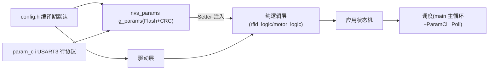

# SUMMARY - stm32_rfid_tts_baremetal

## 一句话描述
stm32_rfid_tts_baremetal：STM32F103C8T6 @72MHz，64KB/20KB 上的读卡语音播报电机控制复刻项目（裸机版（主循环+状态机）），U13T 读卡 + CN-TTS 播报 + 多触发词停车 + 串口配置模式。（2026-08 更新）

## 核心功能
1. 晚启动 A=2s + 缓启动 B=4s 线性加速至 999（运行时可调）
2. 实时读卡：卡在线圈上 LED 常亮，脱离 C=3s 熄灭（运行时可调）
3. TTS 播报：单块 16 字节 GBK；D=10s 相同内容去重；上电提示音 <I>7 号
4. 定时降速：最多 8 段窗口（默认 E=42s 起降为 F=50%，G=5s 后恢复，绝对计时）
5. 触发停车：太阳 1 次触发 / 地球 2 次触发（间隔≥10s）→ 停车序列（H=2s 减速 + I=10s 静止 + 重启）；规则运行时增删
6. 自动停车：autostop_ms 默认 300s 到时永久停（10s~1000s 可调）——原电位器方案已退役（2026-08 更新）
7. 数据输出口：实时输出读卡/电机/LED 状态
8. 串口配置模式（2026-08 新增）：参数存 Flash 末页(0x0800FC00+CRC)，USART3 行协议 CLI 在线读写保存，ISP 软跳免拆烧录，PC 上位机 tools/stm32_host

## 硬件平台
| 项目 | 内容 |
|---|---|
| 芯片 | STM32F103C8T6 @72MHz，64KB/20KB |
| 读卡模块 | U13T（USART1 PA9/10，9600→115200） |
| 语音模块 | CN-TTS（USART2 PA2/3，9600） |
| 电机 | TIM2 双路 PWM2 PA0/1（1kHz，CH1/CH2 差分换向） |
| 电位器 | ADC1_IN9 PB1——硬件退役，配置保留编译（2026-08 更新） |
| LED | PC13/PB12/PA8（低电平亮） |
| 调试输出/配置 CLI | USART3 PB10/11 115200 |

## 架构图

## 已知风险（前 5）
1. CubeMX 重新生成会覆盖 4 处生成代码（USART2 波特率/TIM2 CH2 PWM2/ADC 采样/堆大小[RTOS 版]）
2. printf 重定向在 TTS 语音口(huart2)，调试/CLI 应答必须用 Dbg_Printf→USART3（2026-08 新增强调）
3. ISP 软跳烧录前必须拔 U13T 模块（RX 占用 USART1 干扰 Bootloader）（2026-08 新增）
4. params_t 结构变更会使旧 Flash blob 校验失败→回落默认一次（2026-08 新增）
5. 绝对计时下停车重启后可能立即 STOP（设计既定）；RX 0x7F 反转义缺失（GBK 数据不受影响）

## 代码规模
- 业务源文件：19 个 .c（含 config/ 三模块）；业务函数：77 个
- 主机单元测试：STM32 109 项（Card 25 + rfid_logic 32 + motor_logic 30 + 电机仿真 22，编译前必跑）
- 配套工具：tools/stm32_host PC 上位机（host.py/page.html/README.md）
