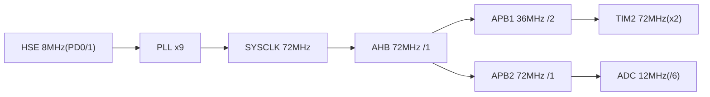

# 硬件配置

## 1. 主控芯片
- **芯片**: STM32F103C8T6（Cortex-M3 @72MHz，64KB Flash / 20KB RAM）✅代码确认
- **系统时钟**: HSE 8MHz × PLL9 = 72MHz；AHB /1；APB1 /2（36MHz）；APB2 /1（72MHz）；ADC /6（12MHz）
- **HAL 时基**: TIM1（FreeRTOS 占用 SysTick）

## 2. 外设资源使用总表
| 外设 | 用途 | 关键参数 | 确认度 |
|---|---|---|---|
| USART1 | U13T 读卡模块 | 9600→115200，8N1，RX 中断 | ✅代码确认 |
| USART2 | CN-TTS 语音模块 | 9600，8N1，printf 重定向 | ✅代码确认 |
| USART3 | 数据输出口 + 参数配置 CLI（2026-08 更新：RX 方向启用，ParamCli_Poll 轮询接收） | 115200，8N1 | ✅代码确认 |
| TIM2 | 电机 PWM（双通道差分，Motor_SetDirection 可交换角色实现反转） | 1kHz，PSC=71，ARR=999，PWM2 双通道 | ✅代码确认 |
| ADC1 | 电位器（**已退役**：初始化仍执行，Get_ADC_Value 无调用方） | IN9，28.5 cycles，连续转换 | ✅代码确认 |
| 内部 Flash | 参数存储页（2026-08 新增）：0x0800FC00 起 1KB，magic+CRC16 保护 | 按页擦写（FLASH_TYPEERASE_PAGES） | ✅代码确认 |
| GPIO | LED×3 | 推挽+上拉，低电平亮 | ✅代码确认 |
| SWD | 调试下载 | PA13/PA14 | ✅代码确认 |
| HSE | 8MHz 晶振 | PD0/PD1 | ✅代码确认 |

## 3. GPIO 引脚分配表
| 引脚 | 功能 | 配置 | 确认度 |
|---|---|---|---|
| PA0 | TIM2_CH1 电机 PWM | AF_PP，低速 | ✅代码确认 |
| PA1 | TIM2_CH2 电机 PWM | AF_PP，低速 | ✅代码确认 |
| PA2 | USART2_TX（TTS） | AF_PP，高速 | ✅代码确认 |
| PA3 | USART2_RX（TTS） | 输入，无上下拉 | ✅代码确认 |
| PA8 | LED（低电平亮） | 推挽输出+上拉，初始高 | ✅代码确认 |
| PA9 | USART1_TX（读卡） | AF_PP，高速 | ✅代码确认 |
| PA10 | USART1_RX（读卡） | 输入，无上下拉 | ✅代码确认 |
| PA13/PA14 | SWDIO/SWCLK | Serial Wire | ✅代码确认 |
| PB1 | ADC1_IN9（电位器，2026-08 起固件不再采样） | 模拟输入 | ✅代码确认 |
| PB10 | USART3_TX（调试输出 + CLI 应答） | AF_PP，高速 | ✅代码确认 |
| PB11 | USART3_RX（参数配置 CLI 接收，任务轮询 RXNE 无中断） | 输入，无上下拉 | ✅代码确认 |
| PB12 | LED | 推挽输出+上拉，初始高 | ✅代码确认 |
| PC13 | LED | 推挽输出+上拉，初始高 | ✅代码确认 |
| PD0/PD1 | OSC_IN/OUT（HSE 8MHz） | 晶振 | ✅代码确认 |

> 接线注意：TTS 模块必须 5V 供电（播报峰值 320mA）；U13T 供电 3.0~5.5V；串口 TX/RX 交叉；共地。
