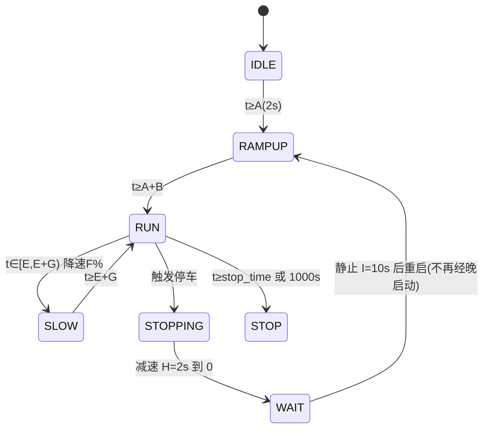

# 系统架构

## 1. 总体分层

- config.h（纯参数）→ hardware/（HAL 驱动）→ 纯逻辑层（无硬件依赖，四版共享）→ 应用状态机 → main 调度
- 依赖单向，无循环；纯逻辑层（rfid_logic/motor_logic）与 STM32/ESP32 各版逐字相同，主机可测

## 2. 启动流程
```mermaid
flowchart TD
    S["上电"] --> H["HAL_Init + SystemClock_Config"]
    H --> P["MX_GPIO/ADC1/TIM2/USART1/2/3 初始化"]
    P --> B["USART1 波特率切换(9600→115200, 先使能接收防ORE)"]
    B --> I["LED_Sta(0) / PWM_Init / Motor_Control(0) / Dbg_Init"]
    I --> T["TTS 设置(语速/音量/保存)"]
    T --> R["RFID 参数初始化 + 卡状态 EXIST"]
    R --> LOOP["运行时调度"]

## 3. 任务模型（FreeRTOS CMSIS_V1）
| 任务 | 优先级 | 栈 | 职责 | 文件 |
|---|---|---|---|---|
| RFID_Task | High(2) | 1024 字 | 读卡五态状态机/播报/LED/触发 | Task/rfid_task.c |
| Motor_Control_Task | Idle(-3) | 512 字 | 电位器采样 + 喂 motor_logic + PWM 输出 | Task/motor_control_task.c |
| defaultTask | Normal | 128 字 | 空转（CubeMX 遗留，无业务） | Core/Src/freertos.c |

- 任务间通信：全局 volatile 标志（card_res_flag 由 ISR 置位任务消费；motor_trigger_flag 由 RFID 置位电机消费）
- RFID_Task 高优先级保证读卡及时；电机任务 1ms 一拍（vTaskDelay(1)）

## 4. 状态机
### 读卡五态（card_res_flag）
```mermaid
stateDiagram-v2
    [*] --> NONE: 上电
    NONE --> EXIST: 读到卡号
    EXIST --> WAIT: 发读块命令
    WAIT --> EXIST: 20ms 超时重发(2次后放弃)
    WAIT --> RESDATA: 收到读块响应
    RESDATA --> LEDLIGHT: 数据有效→处理(触发/去重/播报)
    LEDLIGHT --> NONE: 卡脱离 C 秒后灭灯
    LEDLIGHT --> EXIST: 再次读到卡号
```
### 电机状态机（motor_logic，绝对计时）

