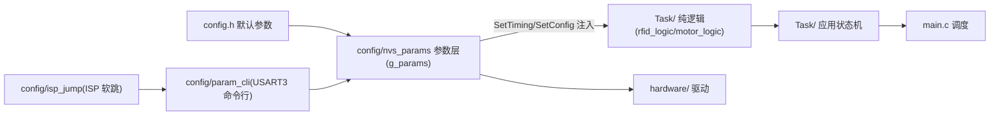
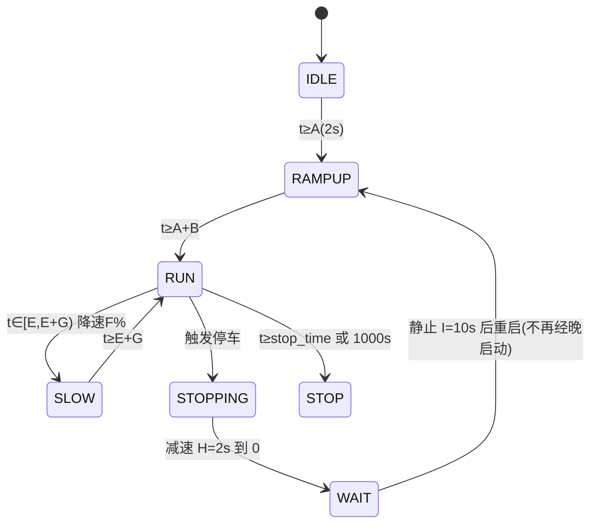

# 系统架构

## 1. 总体分层

- config.h（编译期默认）→ nvs_params（运行时参数 g_params，Flash 末页持久化，params_apply 注入逻辑层）→ 纯逻辑层（无硬件依赖，四版共享）→ 应用状态机 → main 调度
- 依赖单向，无循环；纯逻辑层（rfid_logic/motor_logic）与 STM32/ESP32 各版逐字相同，主机可测
- （2026-08 更新）param_cli 经 USART3 接收命令修改 g_params 后即时 params_apply；isp_jump 提供软跳 Bootloader 的动作钩子

## 2. 启动流程
```mermaid
flowchart TD
    S["上电"] --> H["HAL_Init + SystemClock_Config"]
    H --> P["MX_GPIO/ADC1/TIM2/USART1/2/3 初始化"]
    P --> B["USART1 波特率切换(9600→115200, 先使能接收防ORE)"]
    B --> I["LED_Sta(0) / PWM_Init / Motor_Control(0) / Dbg_Init"]
    I --> PA["MX_FREERTOS Init USER CODE 区<br/>params_init→params_apply→ParamCli_Init<br/>(先于任务创建)"]
    PA --> T["TTS 设置(语速/音量/<I>7 提示音)"]
    T --> R["RFID 参数初始化 + 卡状态 EXIST"]
    R --> LOOP["运行时调度(defaultTask 兼职 CLI 轮询)"]

## 3. 任务模型（FreeRTOS CMSIS_V1）
| 任务 | 优先级 | 栈 | 职责 | 文件 |
|---|---|---|---|---|
| RFID_TASK | High | 1024 字 | 读卡五态状态机/播报/LED/触发（上电 <S>3/<V>6/<I>7） | Task/rfid_task.c |
| Motor_Control_Task | Idle(-3) | 512 字 | Motor_SetDirection(g_params.motor_dir) + 喂 motor_logic + PWM 输出（2026-08 更新：电位器采样已移除） | Task/motor_control_task.c |
| defaultTask | Normal | 512 字（2026-08 由 128 扩容） | ParamCli_Poll() 10ms 节拍轮询 USART3 命令 + ISP 命令处理（freertos.c:134-149） | Core/Src/freertos.c |

- 任务间通信：全局 volatile 标志（card_res_flag 由 ISR 置位任务消费；motor_trigger_flag 由 RFID 置位电机消费）；g_params 全局参数表由 CLI 任务写、业务任务读
- RFID_TASK 高优先级保证读卡及时；电机任务 1ms 一拍（osDelay(1)）；params_init 必须先于任务创建（否则任务首拍读到未初始化参数）

## 4. 状态机
### 读卡五态（card_res_flag）
```mermaid
stateDiagram-v2
    [*] --> NONE: 上电
    NONE --> EXIST: 读到卡号
    EXIST --> WAIT: 发读块命令
    WAIT --> EXIST: 20ms 超时重发(2次后放弃)
    WAIT --> RESDATA: 收到读块响应
    RESDATA --> LEDLIGHT: 数据有效→处理(触发/去重/播报)
    LEDLIGHT --> NONE: 卡脱离 C 秒后灭灯
    LEDLIGHT --> EXIST: 再次读到卡号
```
### 电机状态机（motor_logic，绝对计时）


- （2026-08 更新）电机状态机时序全部来自 `motor_timing_t` 注入（默认=config.h 宏，可经 CLI/上位机修改即时生效）；`stop_time` 上电取 g_params.autostop_ms（默认 300000ms=5 分钟，原电位器换算已退役）；1000s 绝对上限仍硬编码于 motor_logic.c:98（MOTOR_MAX_RUN_TIME_MS）
