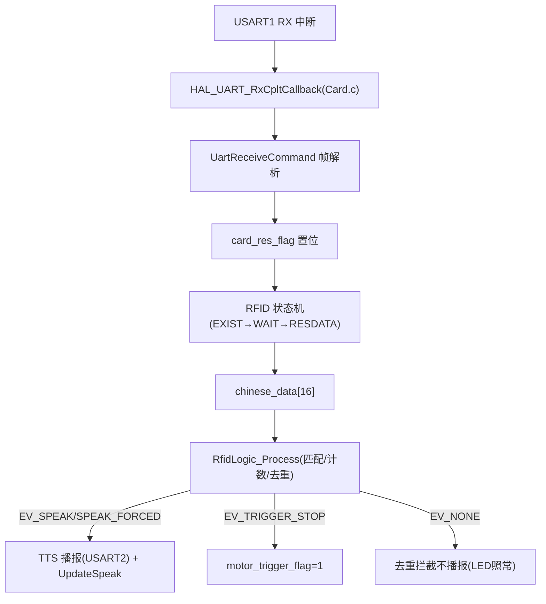
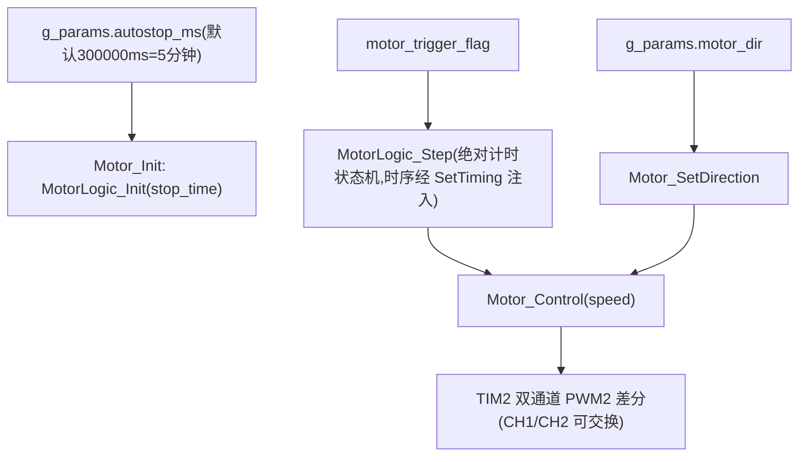

# 数据流与控制流

## 1. 读卡数据流

## 2. 电机控制流

- （2026-08 更新）电位器 ADC 采样×20 与 CalcStopTime 换算已移除；停车时间上电一次取参数。
## 3. 触发停车完整链路
读卡 → rfid_logic 命中规则（太阳第 1 次/地球第 2 次且间隔≥10s）→ EV_TRIGGER_STOP → motor_trigger_flag → MotorLogic_Step 消费 → STOPPING(H=2s 线性减速) → WAIT(I=10s 静止) → RAMPUP(重启缓启动，不再经晚启动) → RUN
## 4. LED 控制流
读到卡 → LEDLIGHT：LED_Sta(1) → 播报后 800ms（RFID_READ_DELAY_MS） → 每 g_params.rfid_poll_ms（默认 800ms）轮询 ReadCard() → 卡在场回调刷新 rfid_last_card_tick → 脱离后 now-last_tick ≥ g_params.led_on_ms（默认 3s）→ LED_Sta(0) 回 NONE
（2026-08 更新：轮询间隔与熄灭延时改为运行时参数，原固定 10ms/3s。）

## 5. 参数配置流（2026-08 新增）
USART3 RXNE（defaultTask 10ms 轮询）→ 行缓冲拼装（\r\n 结尾，192 字节上限，支持退格）→ param_cli_execute 分发：
- SET 系列：改 g_params 字段 → params_apply()（MotorLogic_SetTiming + RfidLogic_SetConfig 即时注入，无需重启）→ Dbg_Printf 应答 OK/ERR
- SAVE：params_sanitize 钳制 → HAL_FLASHEx_Erase 擦 0x0800FC00 页 → 按 4 字节编程 magic+CRC+params_t → 断电保持；下次上电 params_init 读回校验通过则生效，失败回落 config.h 默认
- ISP：应答 OK 后 defaultTask 延时 100ms 再 ISP_Enter() 软跳 Bootloader（需先拔 U13T）；REBOOT：NVIC_SystemReset
