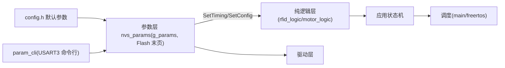

# SUMMARY - stm32_rfid_tts_rtos

## 一句话描述
stm32_rfid_tts_rtos：STM32F103C8T6 @72MHz，64KB/20KB 上的读卡语音播报电机控制复刻项目（RTOS 版（FreeRTOS 三任务）），U13T 读卡 + CN-TTS 播报 + 多触发词停车。（2026-08 更新）新增参数化底座（Flash 末页存储+Setter 注入）、USART3 串口配置命令行与 PC 上位机。

## 核心功能
1. 晚启动 A=2s + 缓启动 B=4s 线性加速至 999
2. 实时读卡：卡在线圈上 LED 常亮，脱离 C=3s 熄灭
3. TTS 播报：单块 16 字节 GBK；D=10s 相同内容去重
4. 定时降速：E=42s 起降为 F=50%，G=5s 后恢复（绝对计时一次）
5. 触发停车：太阳 1 次触发 / 地球 2 次触发（间隔≥10s）→ 停车序列（H=2s 减速 + I=10s 静止 + 重启）
6. 自动停车时间：（2026-08）参数 autostop_ms 默认 300000ms=5 分钟（10~1000s 可调）；电位器采样退役
7. 数据输出口：实时输出读卡/电机/LED 状态
8. （2026-08 新增）串口配置模式：USART3 行协议 HELP/GET/SET/SAVE/DUMP/ISP/REBOOT，改参即时生效、SAVE 断电保持、电机正反转 SET dir
9. （2026-08 新增）PC 上位机 tools/stm32_host：浏览器表单+串口桥+编译烧录按钮；ISP 软跳 Bootloader 免 ST-Link

## 硬件平台
| 项目 | 内容 |
|---|---|
| 芯片 | STM32F103C8T6 @72MHz，64KB/20KB |
| 读卡模块 | U13T（USART1 PA9/10，9600→115200） |
| 语音模块 | CN-TTS（USART2 PA2/3，9600） |
| 电机 | TIM2 双路 PWM2 PA0/1（1kHz，CH1/CH2 差分可换向） |
| 电位器 | ADC1_IN9 PB1（已退役，不再采样） |
| LED | PC13/PB12/PA8（低电平亮） |
| 调试输出/配置口 | USART3 PB10/11 115200（Dbg_Printf 输出 + param_cli 命令行）
| 参数存储 | 内部 Flash 末页 0x0800FC00（magic+CRC16，断电保持） |

## 架构图

## 已知风险（前 3）
1. CubeMX 重新生成会覆盖 4 处生成代码（USART2 波特率/TIM2 CH2 PWM2/ADC 采样/堆大小）
2. 绝对计时下停车重启后可能立即 STOP（设计既定，autostop_ms 默认 5 分钟）
3. LEDLIGHT 轮询间隔默认 800ms（g_params.rfid_poll_ms=RFID_READ_DELAY_MS），原 RFID_LED_POLL_MS=10ms 宏已无使用方；卡脱离检测延迟相应变长

## 代码规模
- 业务 .c 文件：20 个（含 config/nvs_params、param_cli、isp_jump 三新模块）；业务函数约 90 个
- 主机单元测试：STM32 109 项全绿（Card 25+rfid_logic 32+motor_logic 30+仿真 22；编译前必跑）
