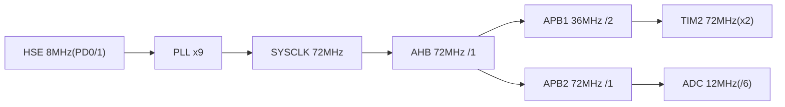

# 时钟树

- 时钟源: HSE 8MHz 晶振；PLL MUL=9（sources/main.c:SystemClock_Config）
- 时基: HAL TIM1（FreeRTOS 占用 SysTick）；FreeRTOS 节拍（RTOS 版）: SysTick 1000Hz（configTICK_RATE_HZ 默认）
- 定时器用途: TIM2=PWM 电机 1kHz（PSC=71, ARR=999）；TIM1（RTOS 版）=HAL 时基 1kHz
